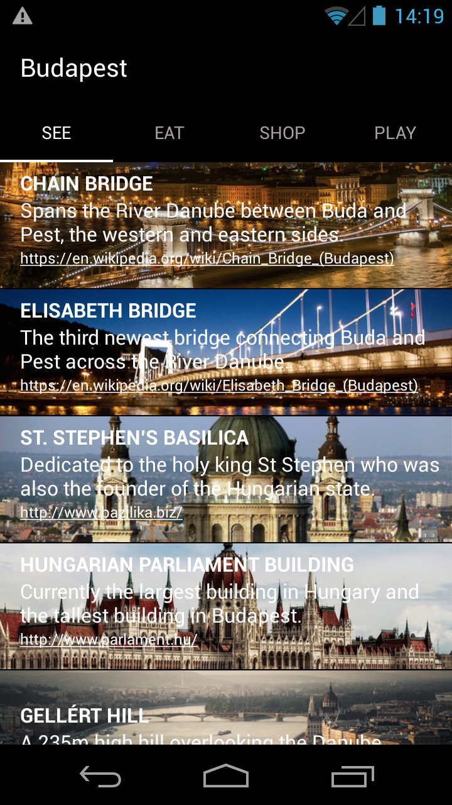
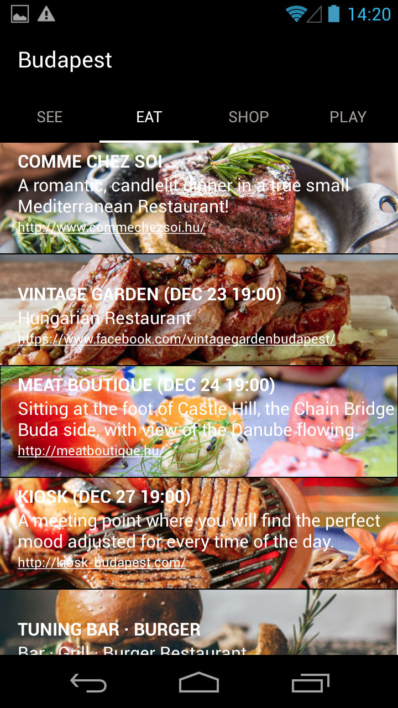
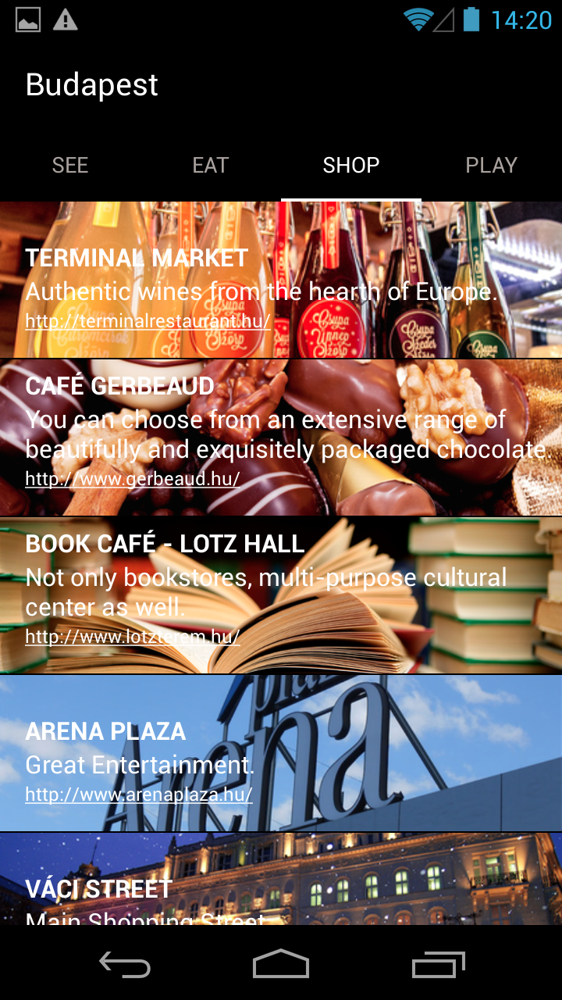
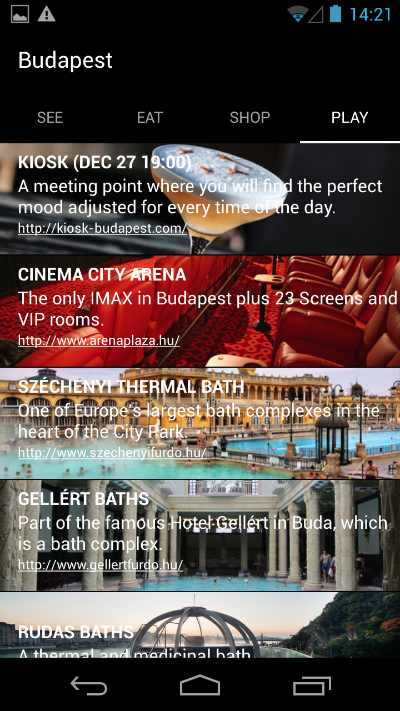

# Budapest
A traveler's guide of Budapest: recommendations from local people.  

Scroll to browse the list of places in the same category e.g. restaurant. 

Swipe to change the category e.g. from restaurants to shopping places.  

Used TabLayout and RelativeLayout to organize tabs and items respectively. 

Customized FragmentPagerAdapter and ArrayAdapter to build data models.  

Images, brief descriptions and contact info are provided for each place. 

Followed good practice to keep strings in string layout resource file. 

Images are carefully chosen and edited to 5 different sizes to support different devices. 

They are stored as drawable resources.

# App ScreenShots
   
